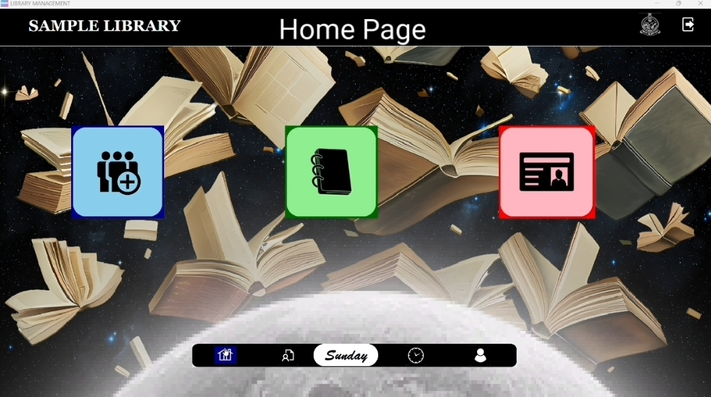
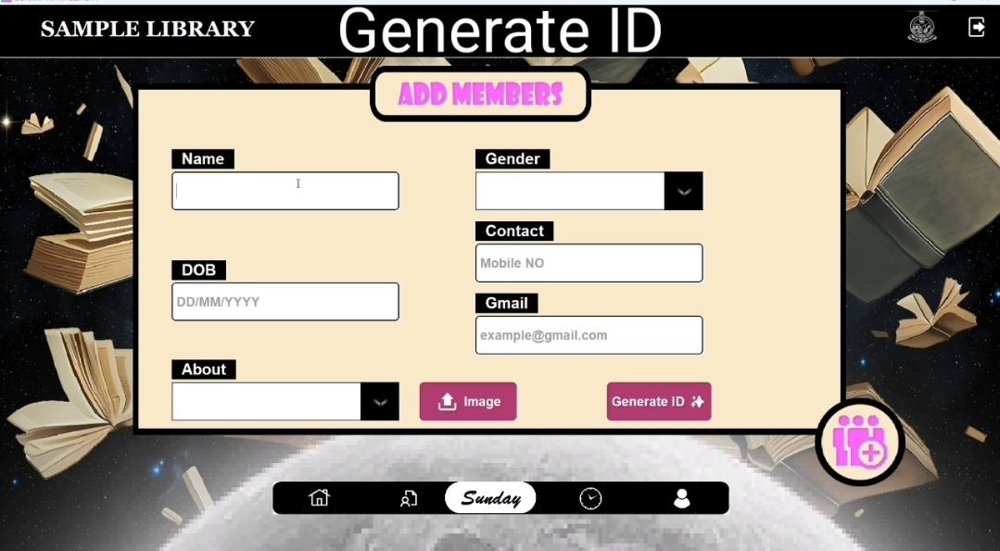
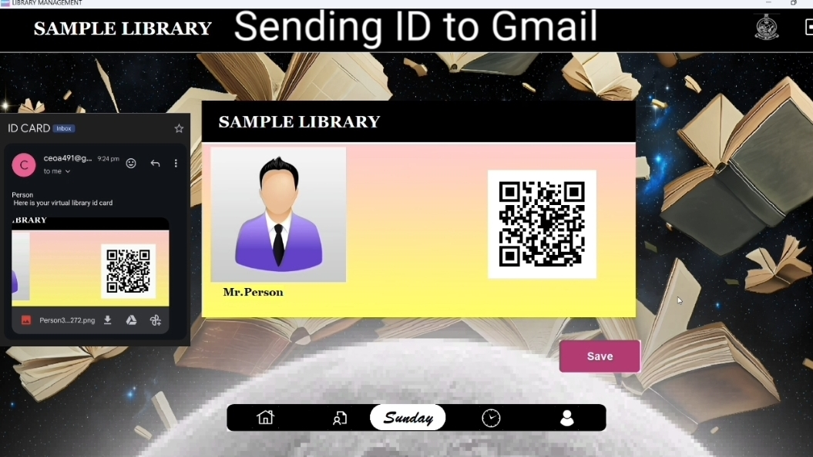
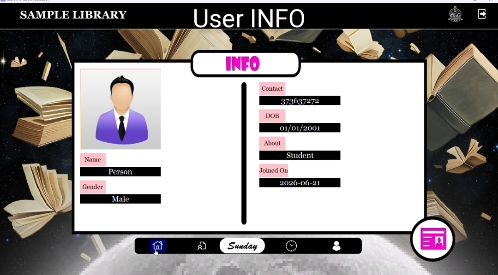
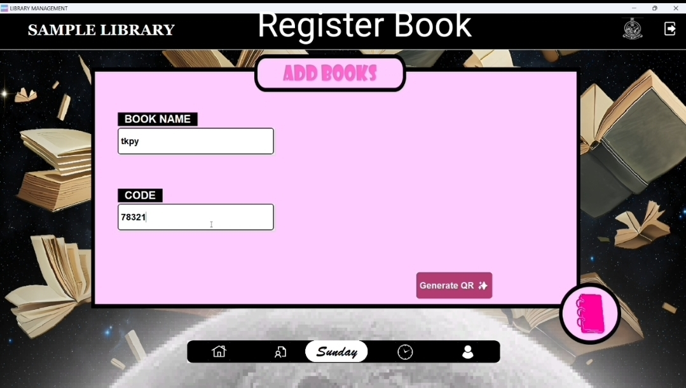
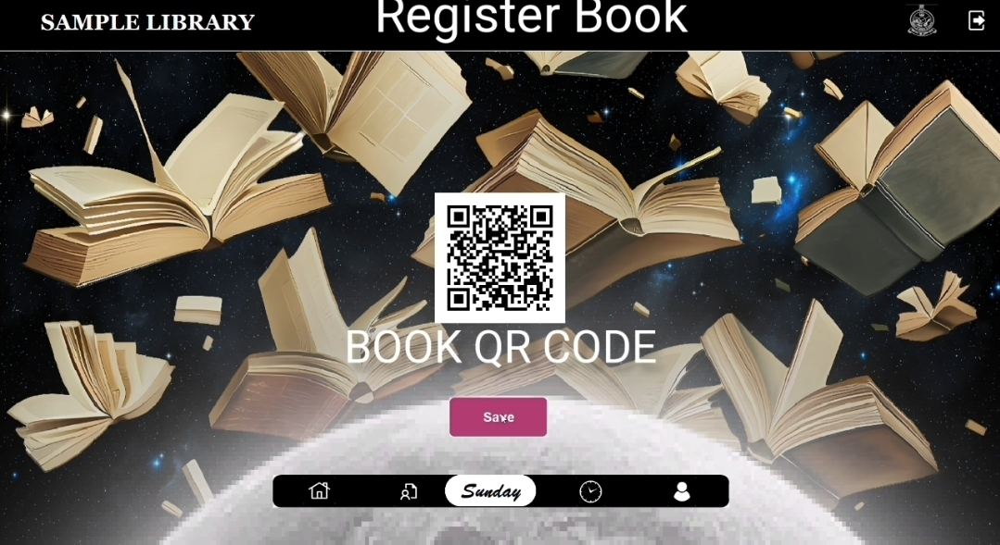
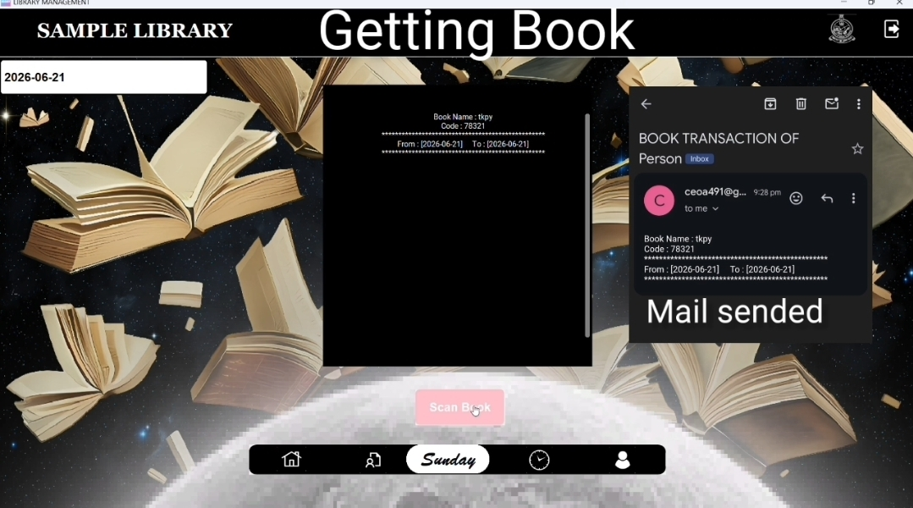
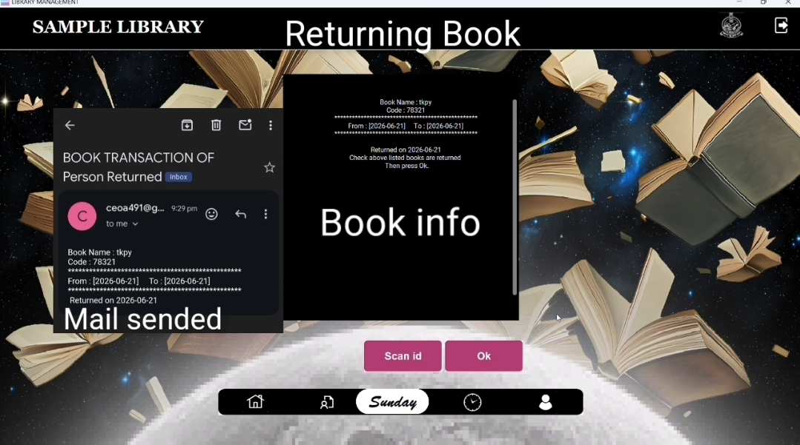
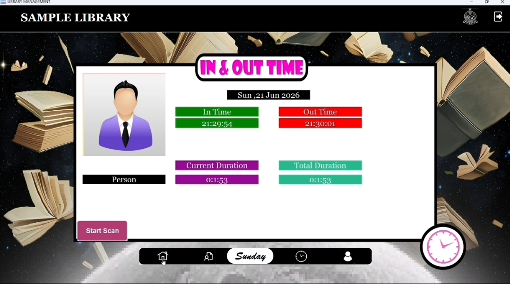
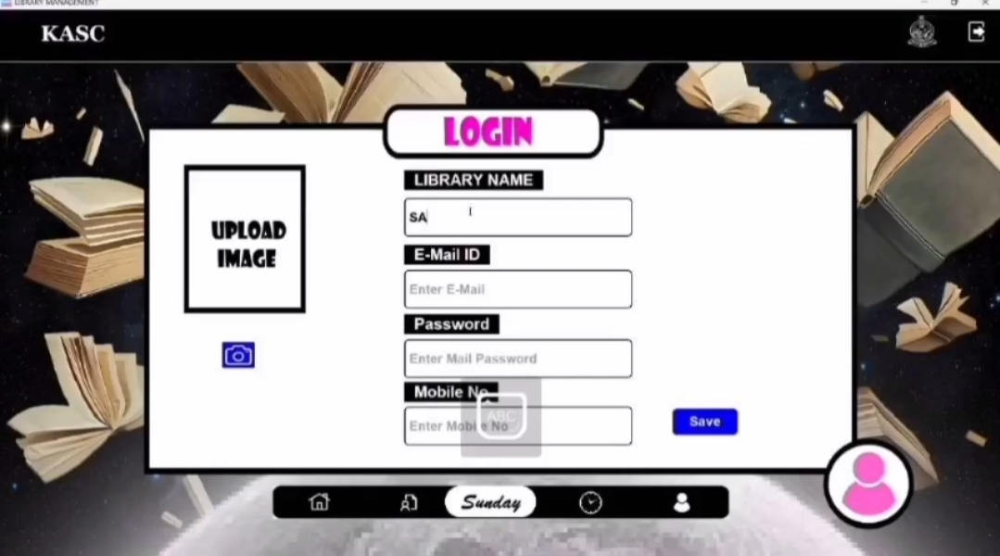

# Library-Management-System
Library Management System with QR-based book tracking, digital ID cards, attendance monitoring, and email automation using Python & CustomTkinter.

A desktop-based Library Management System developed using **Python** and **CustomTkinter**. This application helps libraries manage members, books, QR-based book tracking, digital ID cards, attendance monitoring, and automated email notifications.

---

# 🏠 Dashboard

The Dashboard serves as the main navigation center of the application and provides quick access to all library services.

### Available Options

* Library Name Display
* Library Logo
* Home Button
* Add Member
* Add Book
* View User Information
* Book Services
* In Time / Out Time Tracking
* Exit Button

The dashboard allows librarians to manage all library operations from a single interface, making the system easy to use and navigate.

---

# 👤 Member Registration

The Member Registration module is used to create and maintain library member records.

### Information Required

* Name
* Email Address
* Phone Number
* Date of Birth

The system stores the member details and uses them for identification, attendance tracking, and book transactions.

---

# 🪪 Digital ID Card Generation

After registering a member, the system can automatically generate a digital library ID card.

### Features

* Unique Member ID
* Member Information Display
* QR Code Integration
* Virtual ID Card Creation

The generated ID card is displayed inside the application and can also be sent directly to the member's email address.

---

# 🔍 Scan Member ID

The Scan Member ID module allows librarians to quickly retrieve member information.

### Process

1. Scan the member QR code.
2. The system automatically fetches the stored information.

### Displayed Information

* Name
* Email Address
* Phone Number
* Date of Birth

This feature eliminates manual searching and speeds up member verification.

---

# 📖 Book Registration

The Book Registration module is used to add new books to the library database.

### Information Required

* Book Name
* Book Number

Each registered book receives a unique identity within the system.

---

# 📱 Book QR Generation

Once a book is registered, the system generates a unique QR code for that book.

### Benefits

* Easy Book Identification
* Fast Scanning Process
* Book Tracking
* Reduced Manual Entry

The QR code can be printed and attached to the physical book.

---

# 📚 Issue Book Service

The Issue Book module manages book borrowing operations.

### Steps

1. Scan Member ID.
2. Click **Get Book**.
3. Enter Return Date.
4. Scan Book QR Code.

### System Actions

The system records:

* Member Details
* Book Name
* Book Number
* Issue Date
* Return Date

An email notification containing all transaction details is automatically sent to the member.

---

# 📥 Return Book Service

The Return Book module manages book returns and updates library records.

### Steps

1. Select **Return Book**.
2. Scan Member ID.

### System Actions

The system displays:

* Book Name
* Book Number
* Issue Date
* Return Date
* Actual Returned Date

A return confirmation email is automatically sent to the member.

---

# ⏰ In Time / Out Time Tracking

The attendance tracking module records how long members spend inside the library.

### In Time

When a member scans their ID for the first time:

* Entry time is recorded.
* User is marked as present inside the library.

### Out Time

When the same member scans again:

* Exit time is recorded.
* Current Visit Duration is calculated.
* Total Library Usage Duration is updated.

This feature helps libraries monitor member activity and usage statistics.

---

# 🏛 Library Setup / Configuration

This module is used to create and configure the library system by setting up essential details such as library name, email, password, and phone number.

### Information Required

* Library Name
* Email Address
* Password
* Phone Number

The system uses these details for authentication, communication, and automated email services. This setup ensures that the library is properly configured before using other features like member registration, book management, and QR-based tracking.

This configuration is a one-time setup process that initializes the entire library management system.

---

# 🛠 Technologies Used

### Programming Language

* Python

### GUI Framework

* CustomTkinter

### Additional Technologies

* QR Code Generation
* SMTP Email Automation
* PIL (Python Imaging Library)
* File Handling

These technologies work together to create a complete desktop-based library management solution.

---

# 🔮 Future Improvements

* MySQL Database Integration
* Fine Calculation System
* Book Availability Tracking
* Advanced Search System
* Admin Authentication
* Reports and Analytics Dashboard

---

# 👨‍💻 Author

**Dinesh**

Python Developer | Software Development Enthusiast

GitHub: https://github.com/ceoa491-dev
